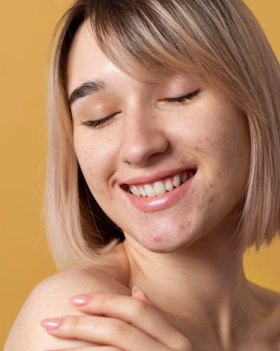
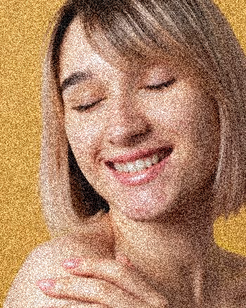
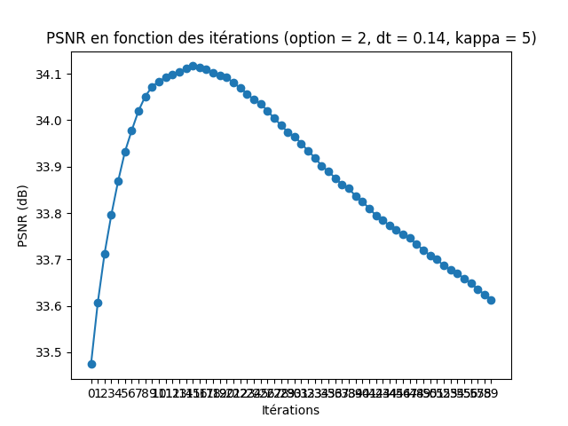
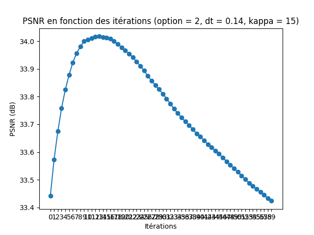
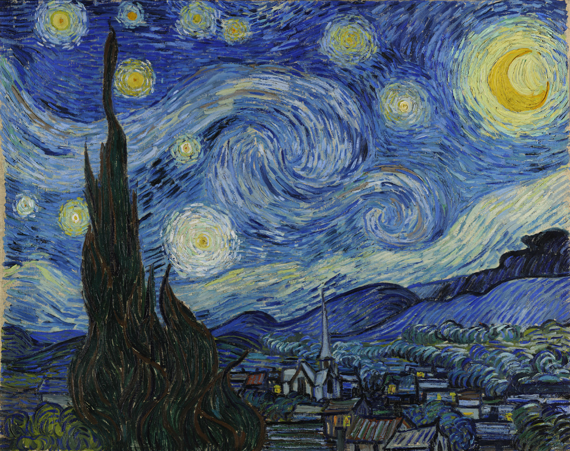
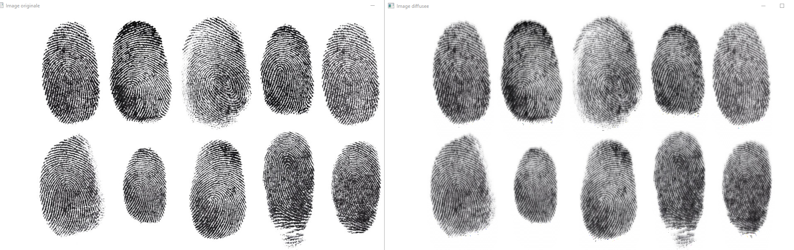

# README

<!-- TOC -->
* [README](#readme)
* [Diffusion Anisotrope pour la Réduction de Bruit d'Images en Niveaux de Gris](#diffusion-anisotrope-pour-la-réduction-de-bruit-dimages-en-niveaux-de-gris)
  * [Dépendances](#dépendances)
    * [Installation des Dépendances](#installation-des-dépendances)
  * [Description du Code](#description-du-code)
  * [Lancement du Programme](#lancement-du-programme)
  * [Exemples](#exemples)
  * [Résultats](#résultats)
* [Diffusion Anisotrope pour la Réduction de Bruit d'Images en Couleurs](#diffusion-anisotrope-pour-la-réduction-de-bruit-dimages-en-couleurs)
  * [Dépendances](#dépendances-1)
    * [Installation des Dépendances](#installation-des-dépendances-1)
  * [Description du Code](#description-du-code-1)
  * [Lancement du Programme](#lancement-du-programme-1)
  * [Exemples](#exemples-1)
  * [Résultats](#résultats-1)
* [Coherence-enhancing diffusion of colour images](#coherence-enhancing-diffusion-of-colour-images)
  * [Dépendances](#dépendances-2)
    * [Installation des Dépendances](#installation-des-dépendances-2)
  * [Description du Code](#description-du-code-2)
  * [Lancement du Programme](#lancement-du-programme-2)
  * [Exemples](#exemples-2)
  * [Résultats](#résultats-2)
* [Difficultés et Remarques](#difficultés-et-remarques)
  * [Difficultés](#difficultés-)
  * [Améliorations Potentielles](#améliorations-potentielles)
* [Conclusion](#conclusion)
* [Sources](#sources)
<!-- TOC -->

# Diffusion Anisotrope pour la Réduction de Bruit d'Images en Niveaux de Gris
Ce projet implémente la diffusion anisotrope selon le modèle de Perona-Malik 
pour réduire le bruit dans des images en niveaux de gris, basé sur l'article
"Scale-Space and Edge Detection Using Anisotropic Diffusion" de Pietro PERONA et Jitendra MALIK.
La diffusion anisotrope est une méthode avancée de traitement d'images permettant de 
préserver les contours tout en supprimant le bruit.

## Dépendances
Pour exécuter ce projet, vous aurez besoin des bibliothèques suivantes :

- Python 3.x
- NumPy
- OpenCV
- ImageIO
- Matplotlib
- sys
- Typing (inclus dans Python 3.5 et versions ultérieures)

### Installation des Dépendances
Vous pouvez installer les dépendances nécessaires en utilisant pip. Exécutez la commande suivante :

`pip install numpy opencv-python imageio matplotlib`

## Description du Code
Le projet se compose des fonctions principales suivantes :

1. PSNR (Peak Signal-to-Noise Ratio)

   - Calcule le rapport signal-bruit de crête entre l'image originale et l'image compressée.

2. diffusion_anisotrope

   - Effectue la diffusion anisotrope sur une image en niveaux de gris.

3. main

   - Fonction principale pour appliquer la diffusion anisotrope sur des images bruitées, calculer le PSNR et sauvegarder les résultats.
   
4. conductance

    - Calcule la conductance en fonction du gradient et des paramètres donnés selon les fonctions proposées par Perona-Malik.

5. barre_de_chargement
   
    - Affiche une barre de chargement en fonction du pourcentage auquel on lui indique.

## Lancement du Programme
   Pour exécuter le programme, utilisez la ligne de commande suivante :

`python PERONA-MALIK.py`

## Exemples
Supposons que vous ayez les images suivantes dans un répertoire img/ :

(image bruitée avec un niveau de bruit de 50)

(image bruitée avec un niveau de bruit de 80)

(image bruitée avec un niveau de bruit de 100)

Pour exécuter le programme avec ces images, il faudrait :

- Mettre dans la variable filename_originale le nom de l'image d'origine :

   filename_originale = f"{dir}femme.jpg"

- Mettre dans la variable filenames_bruite un tableau avec les noms des images bruitées :

   filenames_bruite = [f"{dir}femme-noisy50.png", f"{dir}femme-noisy80.png", f"{dir}femme-noisy100.png"]

## Résultats
Le programme générera des GIFs illustrant l'évolution de la diffusion anisotrope à travers les itérations. Les résultats finaux et les graphiques PSNR seront également affichés.

Par exemple pour "femme-noisy80.png" :

Le GIF qui montre l'évolution de la diffusion

Le graphique PSNR

# Diffusion Anisotrope pour la Réduction de Bruit d'Images en Couleurs
Ce projet implémente la diffusion anisotrope selon le modèle de Perona-Malik 
pour réduire le bruit dans des images en couleurs. C'est une amélioration de l'article principal, l'article
"Scale-Space and Edge Detection Using Anisotropic Diffusion" de Pietro PERONA et Jitendra MALIK. La diffusion anisotrope
est une méthode avancée de traitement d'images permettant de préserver les contours 
tout en supprimant le bruit.

## Dépendances
Pour exécuter ce projet, vous aurez besoin des bibliothèques suivantes :

- Python 3.x
- NumPy
- OpenCV
- ImageIO
- Matplotlib
- sys
- Typing (inclus dans Python 3.5 et versions ultérieures)

### Installation des Dépendances
Vous pouvez installer les dépendances nécessaires en utilisant pip. Exécutez la commande suivante :

`pip install numpy opencv-python imageio matplotlib`

## Description du Code
Le projet se compose des fonctions principales suivantes :

1. PSNR (Peak Signal-to-Noise Ratio)

   - Calcule le rapport signal-bruit de crête entre l'image originale et l'image compressée.

2. diffusion_anisotrope

   - Effectue la diffusion anisotrope sur une image en couleurs.

3. main

   - Fonction principale pour appliquer la diffusion anisotrope sur des images bruitées, calculer le PSNR et sauvegarder les résultats.
   
4. conductance

    - Calcule la conductance en fonction du gradient et des paramètres donnés selon les fonctions proposées par Perona-Malik.

5. barre_de_chargement
   
    - Affiche une barre de chargement en fonction du pourcentage auquel on lui indique.

## Lancement du Programme
   Pour exécuter le programme, utilisez la ligne de commande suivante :

`python PERONA-MALIK-COLOR.py`

## Exemples
Supposons que vous ayez les images suivantes dans un répertoire img/ :

(image bruitée avec un niveau de bruit de 50)

(image bruitée avec un niveau de bruit de 80)

(image bruitée avec un niveau de bruit de 100)

Pour exécuter le programme avec ces images, il faudrait :

- Mettre dans la variable filename_originale le nom de l'image d'origine :

   filename_originale = f"{dir}femme.jpg"

- Mettre dans la variable filenames_bruite un tableau avec les noms des images bruitées :

   filenames_bruite = [f"{dir}femme-noisy50.png", f"{dir}femme-noisy80.png", f"{dir}femme-noisy100.png"]

## Résultats
Le programme générera des GIFs illustrant l'évolution de la diffusion anisotrope à travers les itérations. Les résultats finaux et les graphiques PSNR seront également affichés.

Par exemple pour "femme-noisy80.png" :

Le GIF qui montre l'évolution de la diffusion

Le graphique PSNR

# Coherence-enhancing diffusion of colour images

Cette méthode n'est pas fini d'être développée et ne renvoie donc pas un très bon résultat.

Ce projet implémente le modèle de diffusion améliorant la cohérence pour des images en couleur,
basé sur l'article "Coherence-enhancing diffusion of colour images" par Joachim Weickert. 
Cette technique de diffusion vise à réduire le bruit tout en préservant les contours et la
structure des images en couleur. Cette méthode est particulièrement efficace pour préserver 
les structures de type "flow-like".

La méthode de diffusion de Weickert permet de garder les formes de type "flow-like" 
dans les images. Contrairement à d'autres méthodes, comme Perona-Malik, qui regarde 
les voisins des pixels, celle-ci prend en compte toute l'image. Elle regarde les 
grosses orientations et motifs au lieu des petits détails.

## Dépendances

Pour exécuter ce projet, vous aurez besoin des bibliothèques suivantes :
- Python 3.x
- NumPy
- OpenCV
- Scipy

### Installation des Dépendances

Vous pouvez installer les dépendances nécessaires en utilisant pip. Exécutez la commande suivante :

`pip install opencv-python numpy scipy`

## Description du Code
Le code implémente la diffusion anisotrope basée sur le modèle de Weickert pour les images en 
couleur. Voici une brève description des fonctions principales :

1. compute_structure_tensor_rgb

    - Calcule le tenseur de structure pour chaque canal RGB de l'image.
   
2. smooth_structure_tensor_rgb

    - Applique un flou gaussien sur le tenseur de structure pour chaque canal RGB de l'image.

3. compute_eigenvalues_rgb

    - Calcule les valeurs propres du tenseur de structure pour chaque canal RGB de l'image.

4. coherence_enhancing_diffusivity

    - Calcule la diffusion améliorant la cohérence en fonction des valeurs propres du tenseur de structure.

5. weickert_diffusion

    - Implémente la diffusion anisotrope de Weickert sur une image en couleur pour réduire le bruit tout en préservant les contours.

## Lancement du Programme
Pour exécuter le programme, utilisez la ligne de commande suivante :

`python WEICKERT.py`

## Exemples
Supposons que vous ayez l'image suivante dans un répertoire img/ :

Pour exécuter le programme avec ces images, il faudrait :

- Mettre dans la variable filename_originale le nom de l'image d'origine :

   filename_originale = "img/starry_night.png"

## Résultats

Le programme appliquera la diffusion anisotrope de Weickert sur une image et affichera l'image originale ainsi que l'image diffusée.

Par exemple : 

Image d'origine et image diffusée après 5 itérations

ou 

Image d'origine et image diffusée après 5 itérations

# Difficultés et Remarques
## Difficultés 

- Compréhension des Articles : 

    La compréhension des articles académiques s'est avérée être un défi majeur. 
    La complexité des concepts mathématiques et des techniques de traitement 
    d'images a nécessité un investissement important en termes de temps et d'efforts pour les 
    assimiler correctement.

- Sélection des Bibliothèques : 

    Avec toutes ces bibliothèques disponibles en Python pour le traitement d'images, 
trouver celles qui correspondaient précisément aux fonctionnalités requises a été 
une prise de tête. La recherche et la comparaison des différentes options ont 
demandé une exploration approfondie et une analyse minutieuse.

- Paramétrage des Tests : 

  Déterminer les paramètres optimaux pour les tests a représenté un défi significatif. 
La sélection des constantes appropriées pour les algorithmes, telles que les paramètres de 
conductance, les paramètres de flou gaussien, les pas de temps ou les fonctions de conductance
a nécessité une expérimentation approfondie et une compréhension approfondie de leur impact sur les résultats.

  
## Améliorations Potentielles
- Optimisation des Paramètres : 

    Une piste d'amélioration consisterait à explorer davantage l'espace des paramètres 
des algorithmes implémentés. Des techniques d'optimisation ou d'apprentissage 
automatique pourraient être utilisées pour trouver les valeurs les plus appropriées 
des constantes. Une optimisation plus poussée de ces paramètres pourrait conduire à des 
performances améliorées, tant en termes de réduction du bruit que de préservation des contours.

- Finalisation de l'Implémentation de Weickert : 

    Bien que l'implémentation de la méthode de diffusion de Weickert ait été initiée, 
son achèvement pourrait constituer une amélioration significative. Cependant, 
en raison de la complexité et de la difficulté de l'article original, cette tâche pourrait 
nécessiter un GROS investissement en temps.

# Conclusion
Ce projet a été une plongée enrichissante dans le domaine de la diffusion anisotrope pour le 
traitement d'images. Malgré les défis rencontrés, notamment la compréhension des articles 
académiques et la sélection des paramètres appropriés, il a offert une occasion unique 
d'apprendre et de développer des compétences techniques avancées.

La mise en œuvre des méthodes de Perona-Malik et de la technique de Weickert ont été des 
expériences formatrices, me permettant d'acquérir une compréhension approfondie des concepts 
fondamentaux de la diffusion anisotrope et du flou gaussien. Ces nouvelles connaissances  
 m'ont permis de mieux comprendre les nuances des techniques de traitement d'images.

Enfin, je tiens à remercier Jacques Olivier LACHAUD pour ses conseils tout au long de ce projet.

# Sources

1. https://jacquesolivierlachaud.github.io/lectures/info601cmi/Proj601cmi/perona-malik-1990.pdf
2. https://jacquesolivierlachaud.github.io/lectures/info601cmi/Proj601cmi/weickert-1999.pdf
3. https://www.geeksforgeeks.org/python-peak-signal-to-noise-ratio-psnr/
4. https://stackoverflow.com/questions/16615662/how-to-write-text-on-a-image-in-windows-using-python-opencv2
5. https://openclassrooms.com/forum/sujet/barre-de-progression-avec-du-temps
6. https://www.youtube.com/watch?v=QoN6I_5yOFs&t=78s
7. https://nils-olovsson.se/articles/image_smearing_by_anisotropic_diffusion/
8. https://www.mia.uni-saarland.de/Research/IP_Diffusion.shtml